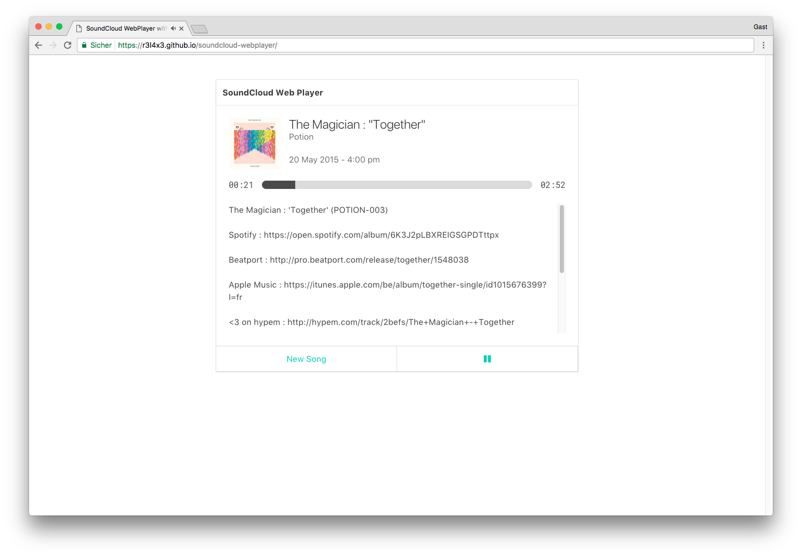

# Vue.js SoundCloud Web Player

A SoundCloud Web Player built with Vue.js

## Demo



Try out the [demo](https://r3l4x3.github.io/soundcloud-webplayer/)!

## Built With / Used

* [Vue.js](https://vuejs.org/) - The JavaScript framework used
* [bulma.io](http://bulma.io) - The CSS framework used
* [GitHub Corners](https://github.com/tholman/github-corners) - by Tim Holman

## Build Setup

``` bash
# install dependencies
npm install

# serve with hot reload at localhost:8080
npm run dev

# build for production with minification
npm run build

# build for production and view the bundle analyzer report
npm run build --report
```

## Inspiration

I wanted to do this web player in Vue.js after seeing the version from [shahzeb1](https://github.com/shahzeb1) here https://github.com/shahzeb1/soundcloud-player/

## License

Copyright (c) 2017, Sebastian Wilms.

This project is licensed under the terms of the MIT license. See [LICENSE.md](LICENSE.md)

